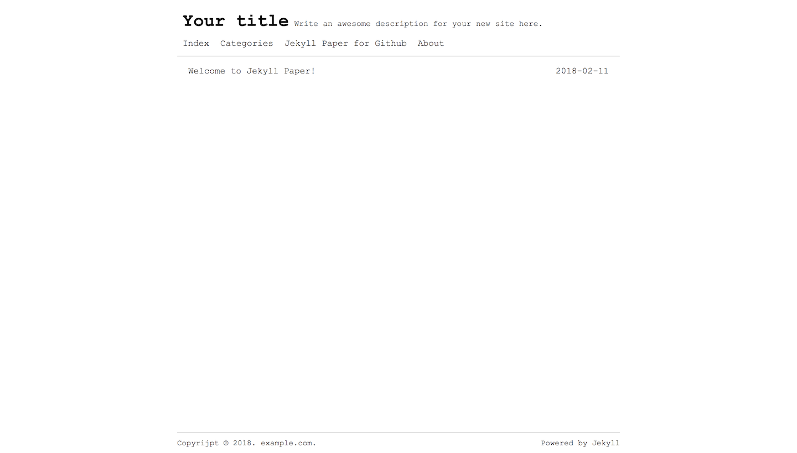
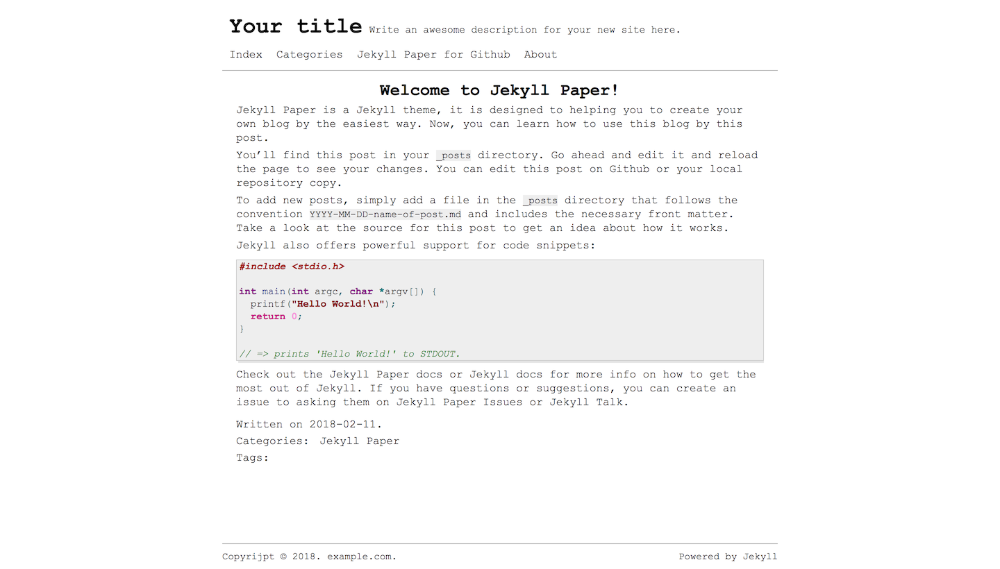

# Jekyll Paper for Github


[English](./README.md) | 简体中文

Jekyll Paper是一个依照纸质书籍排版设计的Jekyll主题，它旨在于帮助你以最方便最快捷的方式创建自己的博客。Jekyll Paper的设计风格以简洁为主，仿照书本的排版设计，使读者能专注于文章的阅读。

Jekyll Paper for Github是[Jekyll Paper][jekyll-paper]的子项目，它专为Github Pages设计，只包含了Github Pages环境支持的插件，可完美运行于Github Pages上。

## 特色

- 响应式设计
- 分页
- RSS
- Sitemap
- 自定义404页面
- SASS
- 多语言支持
- 可配置菜单栏
- SEO优化
- 分类目录索引
- 评论支持 (Disqus)
- 数学公式支持 (MathJax)
- 图表支持 (Mermaid)

## Getting Start

Jekyll Paper for Github的使用方法十分简单，只需要简单的几步即可创建自己的博客：

1. 打开[Jekyll Paper for Github](jekyll-paper-github)主页，登录Github账号并点击Fork，将项目复制到您的账号中。
2. 进入Fork的项目副本，打开设置页面(Setting)。
3. 将Repository name更改为`Github-用户名.github.io`，其中`Github-用户名`需要替换为您的用户名。
4. 访问`Github-用户名.github.io`。

## 发布新的文章

在拥有一个Jekyll博客后，随时可以发布新的文章以及进行修改、删除等操作。发布新的文章只需要进入`_posts`文件夹，以类似于`2018-03-21-xxx.md`的命名风格创建一个新的文件即可。文章内容需要使用Markdown进行编写，且在头部需要设置部分信息，具体可参考`_posts`文件夹中示例文件或参考其它文档。

## 设置导航栏

你可以在`_data/menus.yml`文件中增加或修改导航栏内容，导航栏每个链接配置需要包括名称与URL，具体配置可参照下方。

### 导航栏配置示例

```yml
- title: "Index"
  url:   ""

- title: "About"
  url:   "about"
```

## 支持的语言列表

Jekyll Paper for Github目前支持下列语言，欢迎参与提高翻译质量及增加更多语言。

- 简体中文
- 繁體中文
- English (英语)
- Español (西班牙语)
- Français (法语)
- Deutsche (德语)
- 日本語 (日语)
- Português (葡萄牙语)

## 预览

首页：



文章页：



分类目录页：


## 许可

Jekyll Paper for Github通过MIT许可发布。

## 参与项目

如果您想参与Jekyll Paper for Github的开发，可以在Fork后提交新的PR。

若您有任何建议或者意见，可在[Jekyll Paper for Github Issues][jekyll-paper-github-issues]发布。

[jekyll-paper]: https://github.com/ghosind/Jekyll-Paper
[jekyll-paper-github]: https://github.com/ghosind/Jekyll-Paper-Github
[jekyll-paper-github-issues]: https://github.com/ghosind/Jekyll-Paper-Github/issues
